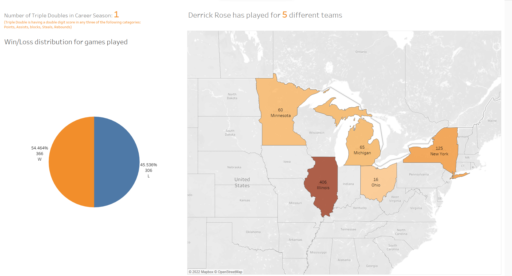
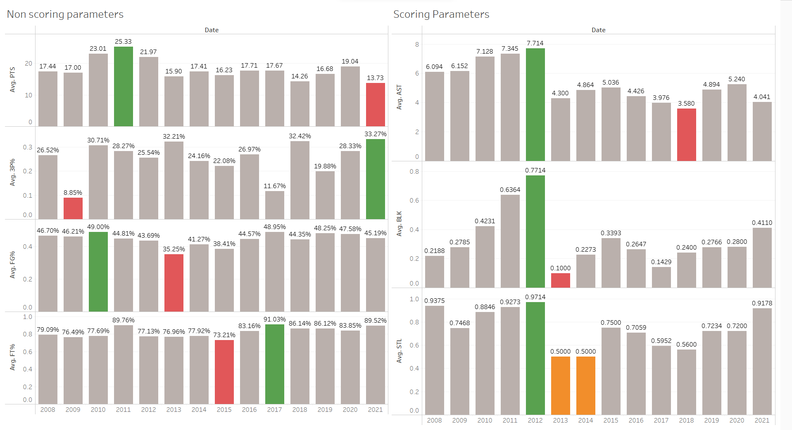

## INSIGHTS

1. Number of Triple doubles during his entire  career.
2. Highest number of assists, passes, steals, and blocks in a game and in which season.
3. Average per game stats.
4. Win/Loss Percentage for every match played.
5. Career growth/transition in stats.
6. Team/Self player.
7. Play style - Offence/Defence

## VISUALIZATIONS

## LINK

[Click on Link to view the Tableau Dashboard]("https://public.tableau.com/app/profile/sagar.paryani/viz/DerrickRoseCareerStats/DB2?publish=yes")